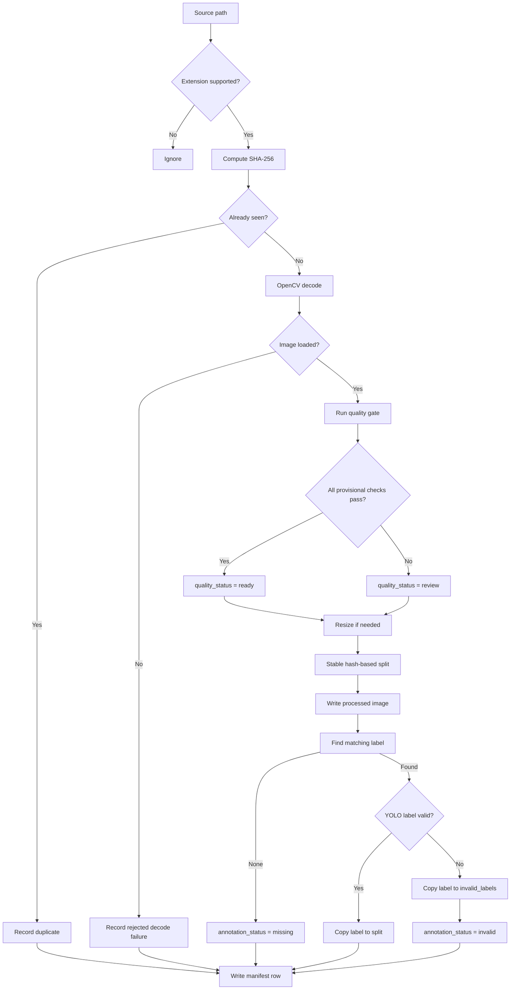
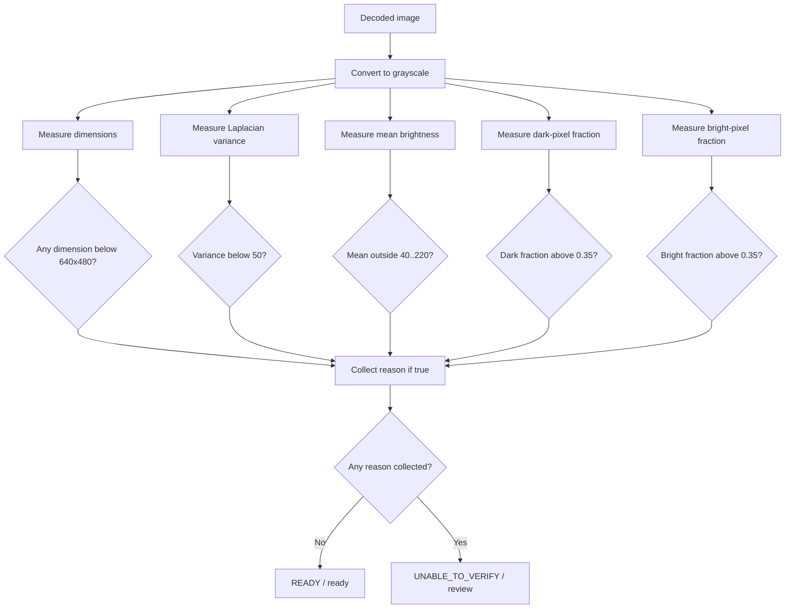
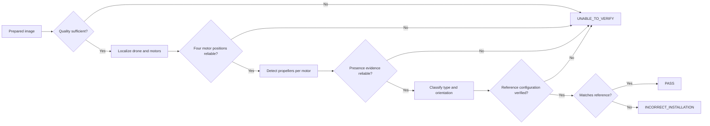

# Pipeline Flowcharts

These diagrams show the decisions made by the current implementation.

## Preparation decision flow

```mermaid
flowchart TD
    A[Source path] --> B{Extension supported?}
    B -->|No| C[Ignore]
    B -->|Yes| D[Compute SHA-256]
    D --> E{Already seen?}
    E -->|Yes| F[Record duplicate]
    E -->|No| G[OpenCV decode]
    G --> H{Image loaded?}
    H -->|No| I[Record rejected decode failure]
    H -->|Yes| J[Run quality gate]
    J --> K{All provisional checks pass?}
    K -->|Yes| L[quality_status = ready]
    K -->|No| M[quality_status = review]
    L --> N[Resize if needed]
    M --> N
    N --> O[Stable hash-based split]
    O --> P[Write processed image]
    P --> Q[Find matching label]
    Q -->|None| R[annotation_status = missing]
    Q -->|Found| S{YOLO label valid?}
    S -->|Yes| T[Copy label to split]
    S -->|No| U[Copy label to invalid_labels]
    U --> V[annotation_status = invalid]
    R --> W[Write manifest row]
    T --> W
    V --> W
    F --> W
    I --> W
```

## Quality-gate logic

```mermaid
flowchart TD
    A[Decoded image] --> B[Convert to grayscale]
    B --> C[Measure dimensions]
    B --> D[Measure Laplacian variance]
    B --> E[Measure mean brightness]
    B --> F[Measure dark-pixel fraction]
    B --> G[Measure bright-pixel fraction]
    C --> H{Any dimension below 640x480?}
    D --> I{Variance below 50?}
    E --> J{Mean outside 40..220?}
    F --> K{Dark fraction above 0.35?}
    G --> L{Bright fraction above 0.35?}
    H --> M[Collect reason if true]
    I --> M
    J --> M
    K --> M
    L --> M
    M --> N{Any reason collected?}
    N -->|No| O[READY / ready]
    N -->|Yes| P[UNABLE_TO_VERIFY / review]
```

## Future inspection logic

```mermaid
flowchart LR
    A[Prepared image] --> B{Quality sufficient?}
    B -->|No| C[UNABLE_TO_VERIFY]
    B -->|Yes| D[Localize drone and motors]
    D --> E{Four motor positions reliable?}
    E -->|No| C
    E -->|Yes| F[Detect propellers per motor]
    F --> G{Presence evidence reliable?}
    G -->|No| C
    G -->|Yes| H[Classify type and orientation]
    H --> I{Reference configuration verified?}
    I -->|No| C
    I -->|Yes| J{Matches reference?}
    J -->|Yes| K[PASS]
    J -->|No| L[INCORRECT_INSTALLATION]
```
